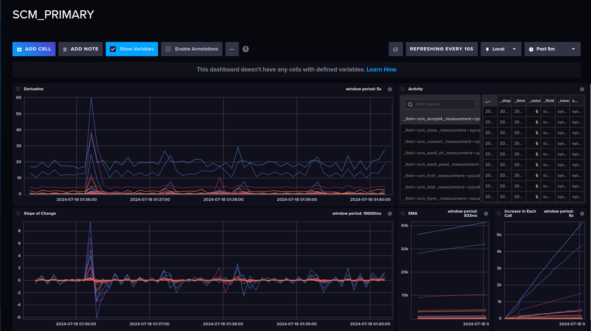
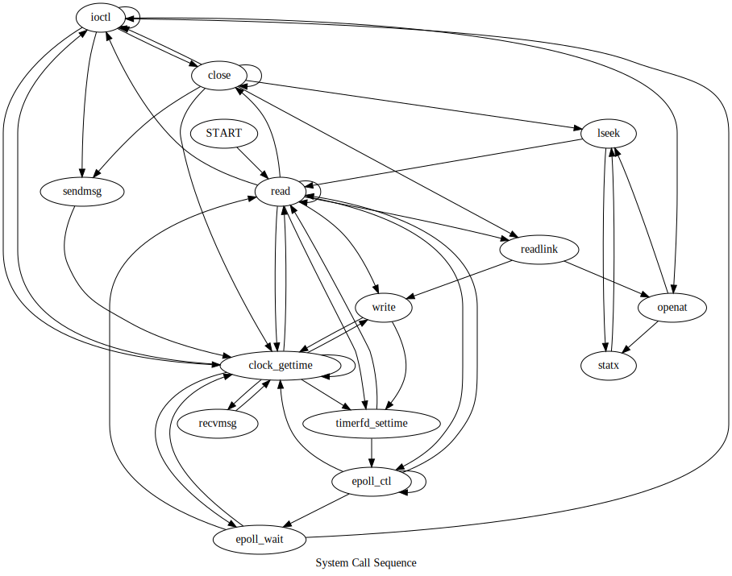
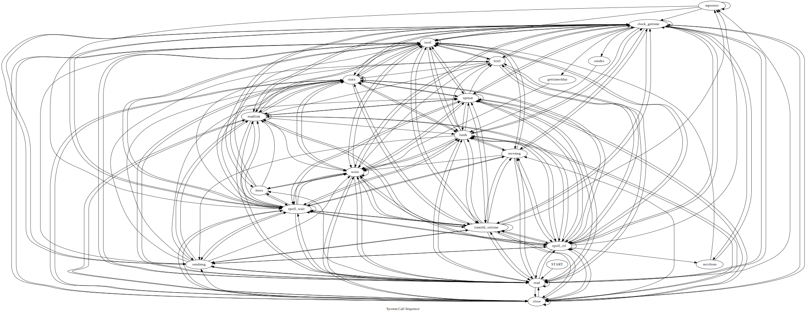

## Introduction [WIP]

SCM or system-call-montior is monitoring/auditing tool aimed at tracing system calls by attaching itself to a running application process. Under the hood it utilized the [eBPF technology](https://ebpf.io), which lets the program to directly interact with the kernel. After attaching to a process, it exports the metrics to prometheus, then it is consumed by Grafana to show dashboards and generate insights for the data.

## Aim

- Develop a CLI tool to attach the program to any process
- Make the tool interoperable for both linux and windows kernel
- Make the tool os independant, it should only rely on the underlying kernel to trace the calls
- Develop dashboards to show effective insights
- Develop auditing tool to generate audit reports of syscalls for a period
- Develop warning generation mechanism

## Running Locally for Development

- Install libbpf `sudo apt install libbpf-dev` for Debian/Ubuntu and `libbpf-devel` for Fedora
- Install clang `sudo apt install clang` and llvm
- Install Kernel Headers using `sudo apt install linux-headers-$(uname -r)`
- On Debian, you may also need `ln -sf /usr/include/asm-generic/ /usr/include/asm`.
- First generate a system call map for your kernel (Currently supports linux kernels) using `make syscall-table` or `ausyscall $(uname -r) --dump > syscall.csv`
- Run `go get` to install all the required packages
- Run `make generate` to compile the eBPF code to object file and generate go scaffolding
- Provision the monitoring resources using `make provision` and shut them down using `make tear`.
- Run `make build` to compile the app
- Run `sudo ./main -n="name of the process you want to trace"` to run the compiled binary, you can also use `-id=<id of proc>` flag to explicilty provide the process id to track.

## Developing Environment

- Go version=1.22.0+
- Linux Kernel=5.7.0+
- [Kernel Config Requirements](https://github.com/iovisor/bcc/blob/master/docs/kernel_config.md) - mostly they are present, but if not, use this to debug

## Debug

- Install bpftool for debugging from source. This [blog](https://thegraynode.io/posts/bpftool_introduction/) covers everything.
- `bpftool prog list` to show all bpf programs loaded
- `bpftool map list` to show all BPF maps loaded
- `bpftool map dump <id>` to display contents of map in json, you can get the id of the map from above list command

## Graph Mode

- To graph out system call sequence, pass the `-g=true` to the program, when you exit the program, it will generate a dot file in the `temp` directory.
- Run `make simple-graph` to generate a simple graph svg of the system calls in the temp folder.

## Visualizations

These are visualizations for the Zed code editor. The first image shows the dashboard for the editor, the second and third images show the sequence of system calls made by the editor for a window of 3s and 10s respectively.
